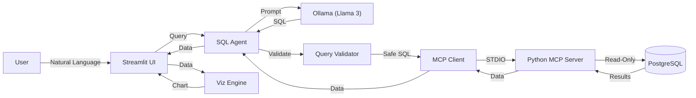

# Database-to-Dashboard Agent

An intelligent, agentic system that transforms natural language business queries into actionable insights. It converts plain English into SQL, executes queries securely against a PostgreSQL database, and automatically generates interactive visualizations.

Built with **Python**, **Streamlit**, **Ollama**, and the **Model Context Protocol (MCP)**.

## Features

- **Natural Language Interface**: Ask questions like "Show me top 10 customers by revenue" or "Sales trend over the last year".
- **Secure Architecture**: Uses a custom **Python MCP Server** to enforce strict **read-only** access to your database. No accidental deletes or updates.
- **Local AI Processing**: Powered by **Ollama** (Llama 3, Mistral, etc.) running locally on your machine. Your data stays private.
- **Auto-Visualization**: Intelligent engine that analyzes data types and selects the best chart (Bar, Line, Scatter, Pie) automatically.
- **Interactive Dashboard**: Built on **Streamlit** for a responsive and modern user experience.

## Architecture

The system follows a secure, modular architecture:



## Prerequisites

- **Python 3.10+**
- **PostgreSQL Database**: A running instance with some data.
- **Ollama**: Installed and running locally.
  - Install: [ollama.com](https://ollama.com)
  - Pull a model: `ollama pull llama3`

## Installation

1. **Clone the repository**
   ```bash
   git clone <repository-url>
   cd Database-to-Dashboard-Agent
   ```

2. **Create a Virtual Environment**
   ```bash
   python -m venv .venv
   source .venv/bin/activate  # On Windows: .venv\Scripts\activate
   ```

3. **Install Dependencies**
   ```bash
   pip install -r requirements.txt
   ```

## ⚙️ Configuration

1. **Environment Variables**
   Copy the example file and configure your database credentials:
   ```bash
   cp .env.example .env
   ```

2. **Edit `.env`**
   Open `.env` and update the values:
   ```ini
   # Database Credentials
   DB_HOST=localhost
   DB_PORT=5432
   DB_NAME=your_database_name
   DB_USER=your_username
   DB_PASSWORD=your_password

   # AI Configuration
   OLLAMA_HOST=http://localhost:11434
   OLLAMA_MODEL=llama3
   ```

## Usage

1. **Start the Application**
   ```bash
   streamlit run app/main.py
   ```

2. **Interact**
   - Open your browser at `http://localhost:8501`.
   - Use the sidebar to adjust database settings or switch LLM models on the fly.
   - Type your question in the chat input.

### Example Queries
- "What are the total sales by country?"
- "List the top 5 products with the highest unit price."
- "Show me the number of invoices per month for 2023."

## Security

This project prioritizes security through the **Model Context Protocol (MCP)**:
- **Read-Only Enforcement**: The custom MCP server (`src/database/postgres_mcp_server.py`) strictly blocks any `INSERT`, `UPDATE`, `DELETE`, `DROP`, or `ALTER` statements.
- **Input Validation**: The `QueryValidator` ensures only valid `SELECT` statements are executed.
- **Isolation**: The database connection is managed in a separate subprocess, isolating the application logic from direct database access.

## Project Structure

```
├── app/
│   └── main.py              # Streamlit application entry point
├── config/                  # Configuration files
├── src/
│   ├── agent/               # Agent logic & query validation
│   ├── database/            # MCP Server & Client implementation
│   ├── llm/                 # Ollama client & prompts
│   └── visualisation/       # Chart generation logic
├── .env                     # Environment variables (git-ignored)
├── requirements.txt         # Python dependencies
└── README.md                # Documentation
```

## License

MIT License
